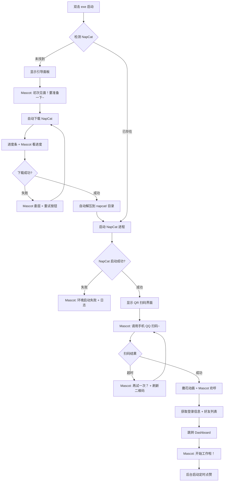
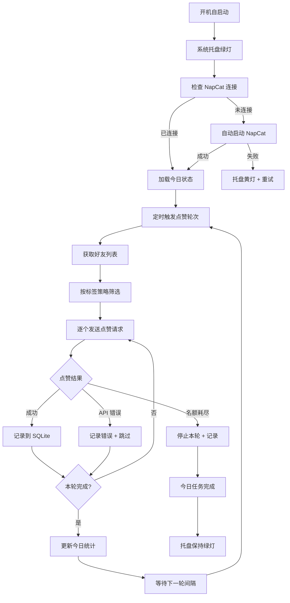
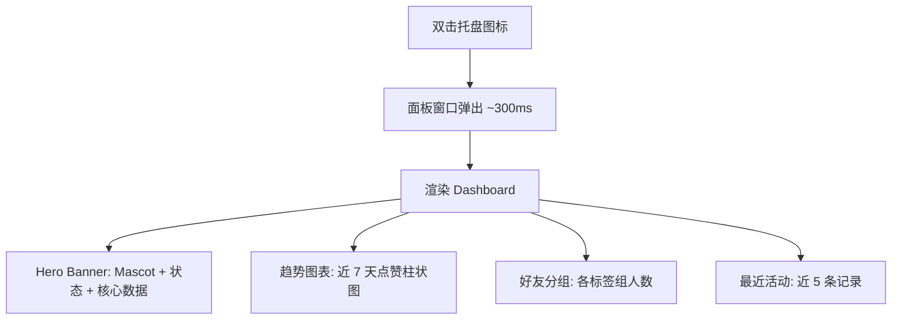
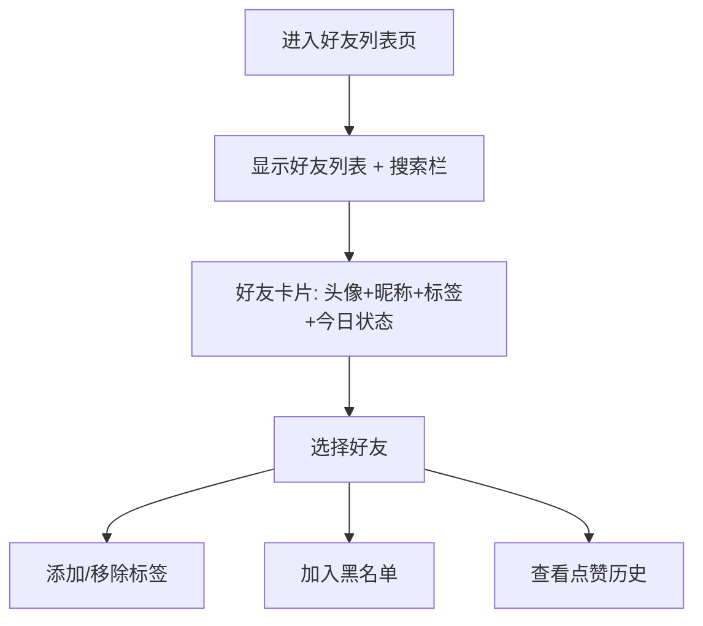
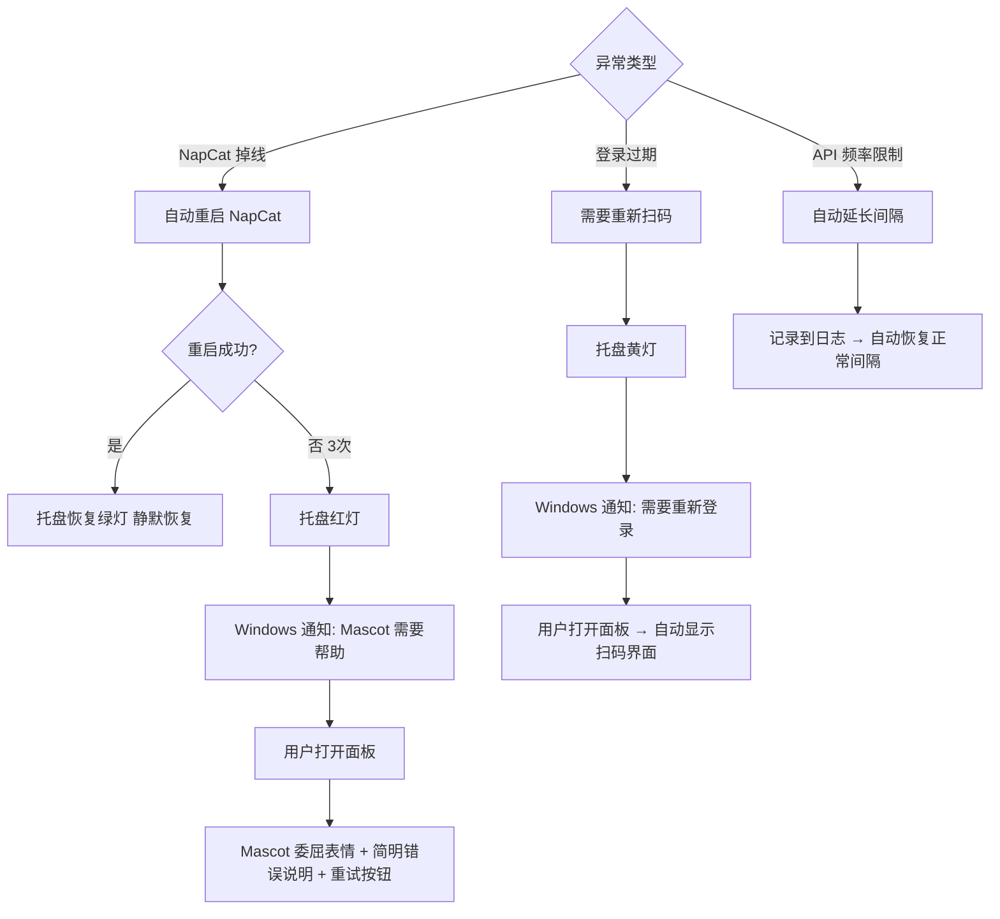

# UX Design Specification qq-auto-like-plus

**Author:** Shira
**Date:** 2026-03-10

---

<!-- UX design content will be appended sequentially through collaborative workflow steps -->

## Executive Summary

### 产品愿景

QQ Auto Like Plus 是一款面向 ACG/二次元文化圈层的 Windows 桌面工具，自动为 QQ 好友主页点赞。
产品以 Kawaii 日式风格为视觉基调，追求"设置一次，忘记存在"的极简体验。
双模态交互：系统托盘静默运行（90%）+ WebView 管理面板按需打开（10%）。

### 目标用户

**ミク酱（主要用户）**
- 16-25 岁，ACG 文化圈层，QQ 重度用户
- 技术水平：基础到中等，会安装 Windows 软件，不熟悉命令行
- 核心诉求：一键启动、可爱好看、后台静默、零维护
- 审美偏好：马卡龙色系、圆角卡片、可爱图标、二次元元素

**技术宅太郎（次要用户）**
- 20-35 岁，了解 OneBot/NapCat 生态
- 核心诉求：灵活配置、数据统计、精细分组策略
- 审美偏好：信息清晰、操作高效，同样欣赏精致的 UI

### 核心设计挑战

1. **双模态一致性** — 托盘图标状态与面板状态实时同步
2. **复杂流程简化** — 首次启动多步骤（下载→解压→启动→扫码）需感觉一气呵成
3. **信息密度与风格平衡** — 数据丰富但视觉不可压迫，保持 Kawaii 轻盈感
4. **设置项渐进呈现** — 15+ 配置参数合理分组，默认值覆盖大部分场景

### 设计机会

1. **Mascot 角色系统** — 二次元 mascot 贯穿引导、空状态、通知，创造情感连接
2. **角色化状态表达** — 用角色表情/动作替代传统状态灯（开心=运行中，睡觉=暂停，慌张=异常）
3. **愉悦微交互** — 点赞完成撒花、名额耗尽可爱提示、数据渐入动画
4. **ACG 暗色美学** — 默认偏向柔和暗色调，呼应二次元用户审美偏好

## Core User Experience

### 核心体验定义

产品的核心价值是用户的「不在场」。应用在系统托盘静默运行，
自动执行点赞、回赞、名额管理。用户 90% 的时间无需任何操作。

关键交互聚焦于两个场景：
1. 首次启动引导（唯一的复杂流程，需极致简化）
2. 按需查看状态（双击托盘 → 一秒获取关键数据）

### 平台策略

- Windows 10+ 桌面应用（Tauri 2.0 WebView）
- 系统托盘常驻 + 固定尺寸面板窗口（~900x600）
- 鼠标/键盘交互
- 利用 Windows 系统通知、托盘、注册表自启动

### 零摩擦交互

- 首次启动：双击 exe → 自动下载 → 扫码 → 完成
- 日常运行：开机自启 → 托盘绿灯 → 零操作
- 查看状态：双击托盘 → Dashboard 即时呈现
- 设置管理：合理默认值，80% 用户无需修改
- NapCat：完全隐藏，用户无感知
- 异常恢复：自动重启，仅必要时通知

### 关键成功时刻

1. 首次扫码成功 → Dashboard 出现 QQ 信息 → mascot 欢迎 → "它在工作了！"
2. 次日查看统计 → "已赞 50 人" → "它帮我做了一切！"
3. 收到回赞事件 → 自动回赞完成 → "社交互惠的温暖感"
4. 一周后查看趋势图 → 稳定运行记录 → "可靠的陪伴感"

### 体验设计原则

1. **静默存在** — 好工具不打扰，但需要时总在
2. **一目了然** — 关键信息一秒可获取
3. **温暖陪伴** — Mascot 角色让工具有温度
4. **渐进复杂** — 简单入门，按需深入
5. **视觉愉悦** — 每次打开面板都是一种享受

## Desired Emotional Response

### 核心情感目标

- **主情感**：温暖的数字陪伴感 — 像乖巧的电子宠物默默维护社交关系
- **辅助情感**：安心（它在替我照顾一切）、愉悦（打开面板心情变好）、成就（社交网络在被维护）

### 情感旅程地图

| 阶段 | 目标情感 | 设计手段 |
|------|---------|---------|
| 首次发现 | 好奇→期待 | 可爱 mascot + 清新 UI |
| 启动引导 | 焦虑→安心 | mascot 陪伴、进度动画、鼓励文案 |
| 扫码成功 | 紧张→喜悦 | 欢呼动画 + 撒花特效 |
| 日常运行 | 无感→安心 | 托盘绿灯 = 安心锚点 |
| 打开面板 | 好奇→满足 | 数据渐入 + mascot 汇报 |
| 查看统计 | 期待→成就 | 漂亮图表 + 趋势向上暗示 |
| 异常发生 | 慌张→理解 | mascot 委屈 + 简明说明 + 自动修复提示 |
| 掉线通知 | 烦躁→接受 | 温和语气 + mascot 指引 |

### 微情感设计

- 信赖 > 怀疑 → 透明状态展示、实时日志
- 愉悦 > 满足 → Kawaii 动画、撒花、可爱空状态
- 从容 > 焦虑 → 保守默认值、自动恢复不惊扰
- 亲切 > 疏离 → mascot 拟人化、温暖文案

### 情感规避清单

- 恐惧 → 明确提醒使用小号 + 保守参数
- 困惑 → 隐藏技术术语（NapCat → "运行环境"）
- 无聊 → ACG 配色 + 动画 + mascot
- 被打扰 → 仅关键异常通知

### 情感设计原则

1. **Mascot 是情感锚** — 所有状态变化通过角色表情传递
2. **色彩传递心情** — 马卡龙色系 = 轻松愉悦，暖色 = 安心
3. **动画创造惊喜** — 克制但精致的微交互提升愉悦感
4. **文案要有温度** — 用拟人化、轻松的语气替代冰冷的系统提示
5. **沉默是金** — 通知克制，只在真正需要时才打扰用户

## UX Pattern Analysis & Inspiration

### 灵感产品分析

**Clash Verge Rev** — Tauri + React 系统托盘工具
- 借鉴：侧边栏图标导航、实时状态图表、暗色主题、配置分组
- 调整：冷峻技术风 → Kawaii 暖色调

**HoYoLAB / 米游社** — ACG 数据面板
- 借鉴：渐变统计卡片、数据可视化配色、成就系统
- 调整：移动端 → 桌面端信息密度

**BiliBili 桌面端** — Mascot 集成
- 借鉴：Mascot 融入 UI、空状态运用、粉蓝色系
- 调整：内容密集型 → 简洁工具型

**Shimeji** — 桌面 Mascot 概念
- 借鉴：多状态表情系统概念
- 调整：桌面宠物 → 面板内 mascot 状态区

### 可迁移模式

**导航**：左侧图标导航栏 + 顶部状态条
**数据**：渐变背景统计卡片 + sparkline 迷你趋势图
**情感**：Mascot 状态区 + 空状态插画 + 操作反馈动画
**引导**：分步向导 + 进度条旁 mascot 等待动作

### 反模式

- 满屏表格 → 卡片化 + 留白
- 纯文字状态 → Mascot 表情 + 拟人化文案
- 弹窗轰炸 → toast + 仅关键通知
- 深灰暗色 → 深紫/深蓝 + 马卡龙点缀
- 多层级菜单 → 扁平一级导航
- 英文术语 → 全中文口语化

### 设计灵感策略

**采用**：侧边栏图标导航、渐变统计卡片、Mascot 自然融入
**改造**：冷色→暖色、移动端→桌面端、桌面宠物→面板内角色
**避免**：企业级数据密度、Material 几何感、Electron 臃肿感

## Design System Foundation

### 设计系统选择

**shadcn/ui + Tailwind CSS 4.x** — 可主题化组件系统 + 实用工具优先样式框架

shadcn/ui 提供高质量、可访问的 headless React 组件（基于 Radix UI），
配合 Tailwind CSS 4.x 的原生 CSS 变量（`@theme`），实现 Kawaii/ACG 风格的深度定制。

### 选择理由

1. **架构一致性** — 技术架构文档已确定 shadcn/ui + Tailwind CSS 4.x，设计系统与工程决策对齐
2. **极致可定制** — shadcn/ui 组件源码直接复制到项目，可逐行修改以实现 Kawaii 圆角、渐变、动画
3. **Tailwind CSS 4.x 原生主题** — `@theme` 指令定义设计 token（颜色、圆角、字体、间距），一处修改全局生效
4. **零运行时开销** — 编译时生成 CSS，符合 Tauri WebView 轻量性能要求
5. **渐进复杂度** — 从基础组件开始，按需扩展自定义 Kawaii 组件（Mascot 区、统计卡片、撒花动画）
6. **无障碍性内置** — Radix UI 提供 ARIA、键盘导航、焦点管理，Kawaii 外观不牺牲可用性

### 实施方式

```
设计 Token 层（Tailwind @theme）
    ├── 颜色系统 → 马卡龙色板 + ACG 暗色主题
    ├── 圆角系统 → 偏大圆角（8px-16px）营造 Kawaii 感
    ├── 字体系统 → 中文圆体 + 日文补充字体
    ├── 间距系统 → 宽松留白，轻盈呼吸感
    └── 阴影系统 → 柔和彩色阴影，拟物质感

shadcn/ui 组件定制层
    ├── Button → 圆润按钮 + hover 弹跳微动画
    ├── Card → 渐变背景统计卡片 + 毛玻璃效果
    ├── Dialog → 圆角对话框 + Mascot 插画
    ├── Toast → Kawaii 风格通知气泡
    └── Navigation → 左侧图标导航栏（图标 + tooltip）

项目自定义组件层
    ├── MascotStatus → Mascot 角色状态区
    ├── StatsCard → 渐变统计卡片 + sparkline
    ├── ConfettiEffect → 撒花/庆祝动画
    └── SetupWizard → 引导向导（含 Mascot 陪伴）
```

### 定制策略

**Tailwind CSS 4.x 主题定制：**
- 利用 `@theme` 指令定义完整的 Kawaii 设计 token 集
- 马卡龙色板作为 `--color-*` CSS 变量（粉、薰衣草、薄荷、奶油、蜜桃）
- 暗色模式使用深紫/深蓝底色 + 马卡龙色点缀（非传统深灰）
- 圆角 token 统一偏大（`--radius-lg: 12px`, `--radius-xl: 16px`）

**shadcn/ui 组件改造：**
- 复制组件源码到 `src/components/ui/`，直接修改样式
- 替换默认配色为 Kawaii 色板
- 增加 hover/active 的弹性缩放（`scale-95` → `scale-100`）微交互
- 重新设计空状态为 Mascot 插画

**自定义组件开发：**
- Mascot 状态系统（SVG/PNG 角色 + CSS transition 切换表情）
- 渐变统计卡片（线性渐变背景 + 毛玻璃叠加）
- 撒花动画（Canvas 或 CSS @keyframes）
- 引导向导（步骤进度 + Mascot 陪伴动画）

## Defining Core Experience

### 定义性体验

**「设置一次，安心遗忘」** — 用户告诉朋友：「我装了个小工具，它自己帮我给所有好友点赞，我什么都不用管。」

这个体验的本质是**信任的建立**：从首次扫码的紧张，到第二天查看统计时的惊喜——「它真的在替我工作！」

产品的定义性体验不是某个操作，而是一种**状态感知**——工具在后台静默运行，
用户 90% 的时间无需任何操作，核心价值恰恰是用户的「不在场」。

### 用户心智模型

**现有解决方式：**
- 手动逐个点赞（繁琐，很快放弃）
- 其他脚本工具（命令行操作、配置复杂、不稳定）
- 完全不点赞（放弃社交维护）

**用户期望的心智模型：**
- 「电子宠物」— 设置好后自己运行，偶尔看看它
- 「自动挡汽车」— 不需要理解引擎，踩油门就走
- 「贴心管家」— 替我处理琐碎的社交礼节

**认知摩擦点及化解：**
- NapCat 是什么？为什么需要下载？→ 隐藏为「运行环境」
- 扫码登录安全吗？→ mascot 鼓励 + 小号提示
- 它真的在工作吗？→ 托盘绿灯 + 实时计数

### 成功标准

| 标准 | 衡量方式 |
|------|---------|
| 「就是好用」 | 首次启动 < 3 分钟完成全部设置 |
| 「聪明感」 | 用户无需理解任何技术概念即可使用 |
| 「即时反馈」 | 双击托盘 < 1 秒看到今日点赞数 |
| 「自动化感」 | 连续 7 天零干预正常运行 |
| 「安心感」 | 托盘图标颜色一眼判断运行状态 |
| 「社交成就」 | 统计面板显示累计点赞数与趋势 |

### 创新与经典模式分析

**经典模式（采用）：**
- 系统托盘常驻 — 用户对此模式极其熟悉（QQ/微信/Steam 都这样）
- 分步引导向导 — 安装程序标准范式，降低认知负担
- Dashboard 数据面板 — 卡片化信息展示，一目了然
- 配置表单 — 分组设置 + 合理默认值

**创新扭转（差异化）：**
- Mascot 状态系统替代传统状态指示灯 — 角色表情 > 红绿灯
- 情感化空状态 — mascot 插画 > 「暂无数据」纯文字
- NapCat 完全透明化 — 用户零感知底层协议层的存在
- 撒花/庆祝微交互 — 点赞完成时的愉悦反馈

**结论**：建立在经典模式之上的 Kawaii 情感化创新——用户不需要学习新范式，但每个熟悉的模式都被赋予了温度。

### 体验机制详解

**1. 启动（Initiation）**

```
触发：双击 exe / 开机自启
     ↓
环境检测：NapCat 是否存在？
     ├─ 否 → 进入首次引导（下载→解压→扫码）
     └─ 是 → 登录状态检查
              ├─ 已登录 → 托盘绿灯，静默运行
              └─ 未登录 → 弹出扫码窗口
```

- mascot 在每个环节陪伴：等待时打瞌睡，下载时看进度条，扫码时举牌指引

**2. 交互（Interaction）**

日常模式（90% 时间）：
- 用户与应用的交互 = 零
- 应用在后台自动执行：定时点赞 → 检测回赞 → 名额管理
- 用户唯一感知 = 托盘图标颜色（绿=正常/黄=警告/红=异常）

按需查看模式（10% 时间）：
- 双击托盘 → 面板弹出（~300ms）
- Dashboard 立即呈现：今日已赞/剩余名额/运行状态
- mascot 在状态区以表情汇报：😊 运行中 / 😴 暂停 / 😰 异常

**3. 反馈（Feedback）**

| 事件 | 反馈方式 |
|------|---------|
| 点赞一轮完成 | 托盘保持绿灯（静默成功） |
| 名额耗尽 | toast 通知：「今天的赞已经用完啦~明天继续！」|
| 收到回赞 | Dashboard 计数器 +1（下次打开可见） |
| NapCat 掉线 | Windows 通知 + mascot 委屈表情 |
| 自动重连成功 | 托盘恢复绿灯（静默恢复） |

**4. 完成（Completion）**

- 用户无需「完成」任何操作——工具持续运行
- 「完成」感来自查看统计时的成就感：「本周累计点赞 350 次」
- 关闭面板 ≠ 退出应用 → 面板消失，托盘保留，后台继续
- 真正退出 = 右键托盘 → 退出 → mascot 挥手告别

## Visual Design Foundation

### 色彩系统

**设计理念：** 马卡龙色系 + ACG 暗色美学。默认暗色模式呼应二次元用户审美偏好，
以深紫/深蓝为底色，马卡龙色作为点缀，营造「温暖夜空下的糖果屋」视觉意象。

**主色板（暗色模式 — 默认）：**

| Token | 色值 | 用途 |
|-------|------|------|
| `--color-bg-base` | `#1a1625` | 页面底色（深紫黑） |
| `--color-bg-card` | `#231f31` | 卡片/面板背景 |
| `--color-bg-elevated` | `#2d2840` | 悬浮层/弹出层 |
| `--color-bg-nav` | `#16121f` | 侧边导航栏 |
| `--color-primary` | `#f2a7c3` | 主色调（樱花粉） |
| `--color-secondary` | `#a7c7f2` | 辅助色（天空蓝） |
| `--color-accent` | `#c3a7f2` | 强调色（薰衣草紫） |
| `--color-mint` | `#a7f2d4` | 薄荷绿（成功/运行中） |
| `--color-peach` | `#f2cfa7` | 蜜桃橙（警告） |
| `--color-text-primary` | `#f0edf5` | 主要文字 |
| `--color-text-secondary` | `#9b95a8` | 次要文字 |
| `--color-text-muted` | `#6b6578` | 辅助说明文字 |

**语义色彩映射：**

| 语义 | 色值 | 场景 |
|------|------|------|
| Success | `--color-mint` 薄荷绿 | 运行中、点赞成功、托盘绿灯 |
| Warning | `--color-peach` 蜜桃橙 | 名额即将耗尽、托盘黄灯 |
| Error | `#f28b8b` 珊瑚红 | 掉线、异常、托盘红灯 |
| Info | `--color-secondary` 天空蓝 | 提示、引导信息 |

**渐变色组合（统计卡片用）：**

| 名称 | 渐变方向 | 用途 |
|------|---------|------|
| 樱花渐变 | `#f2a7c3` → `#c3a7f2` | 今日已赞卡片 |
| 天空渐变 | `#a7c7f2` → `#a7f2d4` | 剩余名额卡片 |
| 薰衣草渐变 | `#c3a7f2` → `#f2a7c3` | 累计统计卡片 |
| 蜜桃渐变 | `#f2cfa7` → `#f2a7c3` | 回赞统计卡片 |

**亮色模式（可选，后续扩展）：**
- 底色切换为 `#faf8ff`（微紫白）
- 卡片背景 `#ffffff` + 彩色柔和阴影
- 主色调保持一致，降低饱和度适配亮背景

### 字体系统

**设计理念：** 圆润柔和的中文字体传递 Kawaii 温暖感，等宽字体用于数据展示。

**字体栈：**

```
--font-primary: "HarmonyOS Sans SC", "PingFang SC", "Microsoft YaHei UI", sans-serif;
--font-display: "HarmonyOS Sans SC", "PingFang SC", sans-serif;  /* 标题 */
--font-mono: "JetBrains Mono", "Cascadia Code", "Consolas", monospace;  /* 数据/日志 */
```

- HarmonyOS Sans SC：圆润的中文无衬线字体，Kawaii 风格匹配度高，免费可商用
- 降级到 PingFang SC（macOS）/ Microsoft YaHei UI（Windows）

**字号层级：**

| Token | 大小 | 行高 | 用途 |
|-------|------|------|------|
| `--text-display` | 24px | 1.3 | 页面标题 |
| `--text-heading` | 18px | 1.4 | 卡片标题 |
| `--text-subheading` | 15px | 1.4 | 分组标题 |
| `--text-body` | 14px | 1.6 | 正文内容 |
| `--text-caption` | 12px | 1.5 | 辅助说明 |
| `--text-stat` | 32px | 1.2 | 统计数字（加粗） |
| `--text-stat-label` | 11px | 1.4 | 统计标签（大写字母间距） |

**字重：**
- Regular (400)：正文
- Medium (500)：小标题、按钮文字
- Bold (700)：统计数字、页面标题

### 间距与布局基础

**设计理念：** 宽松留白 + 呼吸感，避免信息压迫，保持 Kawaii 轻盈感。

**间距单位：** 4px 基础单位

| Token | 值 | 用途 |
|-------|-----|------|
| `--space-1` | 4px | 最小间距（图标与文字） |
| `--space-2` | 8px | 紧凑间距（表单元素内） |
| `--space-3` | 12px | 默认间距（列表项间） |
| `--space-4` | 16px | 标准间距（卡片内边距） |
| `--space-5` | 20px | 舒适间距（分组间） |
| `--space-6` | 24px | 宽松间距（区域间） |
| `--space-8` | 32px | 大区域间距 |

**圆角系统：**

| Token | 值 | 用途 |
|-------|-----|------|
| `--radius-sm` | 6px | 小元素（Badge、Tag） |
| `--radius-md` | 10px | 中等元素（按钮、输入框） |
| `--radius-lg` | 14px | 卡片、面板 |
| `--radius-xl` | 18px | 大卡片、对话框 |
| `--radius-full` | 9999px | 圆形（头像、状态灯） |

**窗口布局（900x600）：**

```
┌─────────────────────────────────────────────┐
│ 56px 侧边导航栏 │       主内容区域            │
│                 │                            │
│  [图标]          │  24px 顶部状态条            │
│  [图标]          │ ┌──────────────────────┐   │
│  [图标]          │ │                      │   │
│  [图标]          │ │   页面内容            │   │
│  [图标]          │ │   (内边距 24px)       │   │
│                 │ │                      │   │
│  ─────          │ │                      │   │
│  [设置]          │ └──────────────────────┘   │
│  [mascot]       │  Mascot 状态区 (可选)       │
└─────────────────────────────────────────────┘
```

- 侧边栏：56px 宽，图标导航，深色背景
- 主内容区：剩余空间，24px 内边距
- 顶部状态条：24px 高，显示连接状态 + 登录信息
- Mascot 状态区：Dashboard 页右下角或底部

### 无障碍考量

**对比度：**
- 主要文字 `#f0edf5` on `#1a1625` = 对比度 13.2:1（超过 AAA 标准 7:1）
- 次要文字 `#9b95a8` on `#1a1625` = 对比度 5.1:1（满足 AA 标准 4.5:1）
- 所有交互元素确保 >= 4.5:1 对比度

**交互可访问性：**
- 所有按钮/链接具有 focus-visible 样式（马卡龙色 outline）
- 键盘导航支持（Tab 顺序、Enter 确认、Esc 关闭）
- 托盘图标颜色辅以形状区分（不仅依赖颜色传达状态）
- Toast 通知自动消失前保留足够阅读时间（>= 4 秒）

**动画安全性：**
- 尊重 `prefers-reduced-motion` 系统设置
- 减弱动画模式下：撒花 → 静态成功图标，渐入 → 直接显示
- 所有动画 <= 300ms，避免前庭功能敏感用户不适

## Design Direction Decision

### 设计方向探索

共探索 6 种设计方向：经典仪表盘、Mascot 中心、毛玻璃拟态、渐变流动、紧凑枢纽、极简禅意。
详细交互式对比见 `ux-design-directions.html`。

### 选定方向

**Direction 4（渐变流动）+ Direction 2（Mascot 中心）融合方案**

核心布局：
- 侧边栏圆形图标导航（渐变发光选中态）
- 顶部 Hero 区域融合 Mascot 角色 + 状态文案 + 核心三数据
- 下方双列卡片网格（趋势图、好友分组、活动日志等）
- Mascot 在 Hero 区以自然姿态出现，根据运行状态切换表情和台词

### 设计决策理由

1. **Hero Banner 即信息中枢** — 打开面板第一眼即获取 Mascot 状态 + 关键数据，实现「一秒确认」
2. **Mascot 自然融入** — 不独占右侧空间，而是作为 Hero 区的一部分，平衡情感与功能
3. **渐变 + 马卡龙色 = ACG 美学** — 柔和渐变光效呼应米游社/HoYoLAB 审美，符合目标用户偏好
4. **双列卡片兼容** — 既能容纳图表等宽内容（full span），又能高效利用空间
5. **圆形导航按钮** — 比方形图标更 Kawaii，渐变发光选中态增加愉悦感
6. **开发可行性** — 布局结构清晰，CSS Grid + Flexbox 即可实现，无复杂嵌套

### 实施方式

```
┌──────────────────────────────────────────────┐
│ 侧边栏(64px)  │          主内容区             │
│                │                              │
│  ○ Dashboard  │ ┌────────────────────────┐   │
│  ○ Friends    │ │  Hero Banner (120px)    │   │
│  ○ Tags       │ │  😸 + 状态 + 核心数据   │   │
│  ○ Logs       │ ├────────────┬───────────┤   │
│               │ │  趋势图表   │  好友分组  │   │
│  ─────        │ ├────────────┴───────────┤   │
│  ○ Settings   │ │     最近活动 (全宽)      │   │
│               │ └────────────────────────┘   │
└──────────────────────────────────────────────┘
```

- Hero 区：线性渐变背景（马卡龙色 15% 不透明度），Mascot 左侧，状态文案中间，三数据右侧
- 卡片：`var(--bg-card)` 背景 + 14px 圆角 + 微妙边框
- 导航：选中态使用 primary→accent 渐变 + box-shadow 发光
- 页面切换：React Router 路由，每个页面复用相同的侧边栏 + Hero 框架

## User Journey Flows

### 旅程 1: 首次启动引导（US-001 + US-002）

**目标：** 从双击 exe 到自动点赞开始运行，< 3 分钟。



**关键设计决策：**
- 下载/解压阶段用户只需等待，Mascot 动画陪伴
- 扫码是唯一需要用户操作的步骤，界面清晰突出二维码
- 成功后撒花动画创造情感高峰
- 全程无需用户理解「NapCat」概念

### 旅程 2: 日常静默运行（US-003 + US-004 + US-007）

**目标：** 零用户操作，后台自动完成所有任务。



**回赞子流程：**
- 收到点赞 Webhook → 检查自动回赞开关 → 是则自动回赞并记录 → 否则仅记录

**关键设计决策：**
- 用户零操作 — 整个流程完全自动化
- 托盘图标颜色是唯一的外部可感知反馈
- 名额管理自动化 — 耗尽时静默停止，不打扰用户
- 错误容忍 — 单个好友失败不中断整轮

### 旅程 3: 查看状态（US-009 + US-012）

**目标：** 双击托盘 → 1 秒内获取关键数据。



**用户可选操作：** 点击侧边栏导航切换页面（好友/标签/日志/设置）
**关闭行为：** 点击关闭按钮 → 面板隐藏 → 托盘保留 → 后台继续运行

**关键设计决策：**
- Dashboard 是默认页面，首屏即展示核心数据
- Hero 区 Mascot 表情即时传达运行状态（无需阅读文字）
- 关闭面板 ≠ 退出应用（明确提示首次用户）

### 旅程 4: 好友与标签管理（US-006）

**目标：** 灵活分组好友，设置差异化点赞策略。



**标签管理子流程：**
- 进入标签管理页 → 创建/编辑/删除标签 → 设置标签颜色 + 点赞次数(1-20) + 优先级(高/中/低)

**关键设计决策：**
- 好友列表支持搜索 + 标签筛选
- 标签使用马卡龙色彩区分
- 黑名单操作需二次确认 + Mascot 提醒

### 旅程 5: 异常恢复

**目标：** 自动恢复，仅必要时通知用户。



**关键设计决策：**
- 自动恢复优先 — 3 次重试后才通知用户
- 通知用 Mascot 语气 — 「遇到了一点小问题~」而非冰冷的错误代码
- 需要用户操作时直接导向解决方案（扫码界面 / 重试按钮）

### 旅程模式总结

**导航模式：**
- 侧边栏图标 → 页面切换（扁平一级导航，无子菜单）
- 托盘右键菜单 → 快捷操作（显示面板/暂停/退出）
- 面板关闭 → 隐藏到托盘（非退出）

**反馈模式：**
- 成功操作 → 静默（不打扰）或 toast（重要操作）
- 进行中 → 进度条 + Mascot 动画
- 异常 → Windows 通知 + 面板内 Mascot 表情 + 简明文案

**恢复模式：**
- 自动重试 → 静默恢复 → 仅失败时通知
- 需要用户操作 → 直接导向解决方案页面
- 所有错误提供「一键重试」

### 流程优化原则

1. **最少步骤原则** — 每个旅程的用户操作步骤最小化
2. **即时反馈原则** — 每个操作都有可感知的响应（< 300ms）
3. **容错恢复原则** — 自动恢复优先于用户干预
4. **情感化异常原则** — 错误场景也用 Mascot 温暖化处理
5. **状态一致性原则** — 托盘状态与面板状态实时同步

## Component Strategy

### 设计系统组件覆盖

**可直接使用的 shadcn/ui 组件：**

| 组件 | 用途 | Kawaii 定制需求 |
|------|------|----------------|
| Button | 操作按钮 | 圆角加大 + hover 弹跳 |
| Card | 内容卡片容器 | 渐变背景 + 毛玻璃边框 |
| Dialog | 确认/编辑弹窗 | 圆角加大 + Mascot 插画 |
| Toast | 操作反馈通知 | Kawaii 气泡样式 |
| Input | 搜索框/输入 | 圆角 + 柔和聚焦色 |
| Select | 下拉选择 | 圆角弹出层 |
| Switch | 开关设置 | 马卡龙色滑块 |
| Tooltip | 侧边栏图标提示 | 圆角 + 半透明 |
| Badge | 标签/状态标记 | 马卡龙色系 |
| ScrollArea | 列表滚动 | 细滚动条 + 淡入淡出 |
| Separator | 分隔线 | 渐变分隔线 |
| Tabs | 页内切换 | 仅日志页可能用到 |

### 自定义组件

**HeroBanner**
- **用途：** Dashboard 顶部 Hero 区，融合 Mascot + 状态 + 核心数据
- **内容：** 左侧 Mascot 表情，中间状态文案，右侧三个核心数据
- **状态：** 正常运行（渐变背景）/ 警告（暖色渐变）/ 异常（红色调）/ 暂停（灰色调）
- **尺寸：** 全宽 × 120px
- **无障碍：** `role="banner"`, `aria-label="运行状态概览"`

**MascotDisplay**
- **用途：** 展示 Mascot 角色的不同状态表情
- **内容：** SVG/PNG 角色图 + 状态台词气泡
- **状态：** happy（运行中）/ sleeping（暂停）/ worried（异常）/ cheering（成功）/ waiting（加载中）/ waving（退出）
- **变体：** 大尺寸（Hero 区 64px）/ 小尺寸（侧边栏 32px）/ 全屏（引导页 128px）
- **交互：** hover 时微动画（弹跳/摇摆）
- **无障碍：** `aria-label="状态: {当前状态描述}"`

**StatCard**
- **用途：** 展示单个统计指标
- **内容：** 标签 + 数值 + 副标题/变化趋势 + 可选 sparkline
- **状态：** 默认 / 数据加载中（骨架屏）/ 无数据
- **变体：** pink（樱花渐变）/ blue（天空渐变）/ purple（薰衣草渐变）/ peach（蜜桃渐变）
- **交互：** hover 时轻微上浮（translateY -2px）
- **无障碍：** `aria-label="{标签}: {数值}"`

**SidebarNav**
- **用途：** 左侧固定图标导航栏
- **内容：** 图标按钮列表 + 底部设置/Mascot
- **状态：** 默认 / hover / active（渐变发光）/ 通知指示点
- **尺寸：** 64px 宽，图标 36px 圆形
- **交互：** 点击切换路由，tooltip 显示页面名称
- **无障碍：** `nav` 角色, `aria-current="page"` 标记当前页

**SetupWizard**
- **用途：** 首次启动引导流程
- **内容：** 步骤指示器 + 当前步骤内容 + Mascot 陪伴区
- **步骤：** 欢迎 → 下载环境 → 启动环境 → 扫码登录 → 完成
- **状态：** 各步骤（进行中/完成/等待）+ 错误状态
- **交互：** 自动推进（下载/启动）/ 用户操作（扫码）/ 重试
- **无障碍：** `aria-label="设置引导 步骤 {n}/{total}"`

**QRCodePanel**
- **用途：** 展示 QQ 扫码登录二维码
- **内容：** 二维码图片 + 状态文字 + Mascot 提示
- **状态：** 等待扫码 / 扫码成功 / 超时 / 加载中
- **交互：** 超时后点击刷新二维码
- **无障碍：** `aria-label="QQ 扫码登录"`, 超时时 `aria-live="polite"`

**FriendCard**
- **用途：** 好友列表中的单个好友展示
- **内容：** 头像 + 昵称 + 标签列表 + 今日点赞状态
- **状态：** 已赞（绿勾）/ 未赞 / 黑名单（灰色）
- **交互：** 点击展开详情 / 右键上下文菜单
- **无障碍：** `aria-label="{昵称} {状态}"`

**TagBadge**
- **用途：** 马卡龙色标签展示
- **内容：** 标签名 + 颜色 + 可选删除按钮
- **变体：** 按标签自定义颜色，马卡龙色系
- **交互：** 点击筛选 / 删除按钮移除

**ActivityFeed**
- **用途：** 最近点赞/回赞活动时间线
- **内容：** 时间戳 + 事件类型图标 + 好友名 + 操作描述
- **状态：** 有数据 / 空状态（Mascot「还没有活动哦~」）
- **交互：** 滚动加载更多
- **无障碍：** `aria-label="最近活动"`, `role="feed"`

**ConfettiEffect**
- **用途：** 扫码成功/特殊成就时的撒花庆祝
- **实现：** Canvas 或 CSS @keyframes
- **触发：** 首次扫码成功 / 累计点赞里程碑
- **持续：** 2-3 秒后自动消失
- **无障碍：** `prefers-reduced-motion` 时替换为静态成功图标

**TrendChart**
- **用途：** 近 7 天点赞趋势柱状图
- **实现：** Recharts 封装
- **内容：** 日期 × 点赞数柱状图 + 马卡龙渐变色
- **状态：** 有数据 / 加载中 / 无数据

**StatusBar**
- **用途：** 顶部连接状态条
- **内容：** 状态指示灯 + 运行时长 + 用户昵称 + 头像
- **尺寸：** 全宽 × 36px

### 组件实施策略

**构建原则：**
1. 所有自定义组件使用 Tailwind CSS 4.x 设计 token，确保与 shadcn/ui 风格一致
2. 组件内部使用 shadcn/ui 基础组件（Button、Badge 等）组合
3. 状态管理通过 props 传入，组件本身无副作用
4. 每个组件导出 TypeScript 类型定义

**目录结构：**
```
src/components/
├── ui/              # shadcn/ui 组件
├── layout/          # SidebarNav, StatusBar, HeroBanner
├── dashboard/       # StatCard, TrendChart, ActivityFeed
├── mascot/          # MascotDisplay, ConfettiEffect
├── setup/           # SetupWizard, QRCodePanel
└── friends/         # FriendCard, TagBadge
```

### 实施路线图

**Phase 1 — 核心骨架：** SidebarNav, StatusBar, SetupWizard, QRCodePanel, MascotDisplay, HeroBanner
**Phase 2 — 数据展示：** StatCard, TrendChart, ActivityFeed
**Phase 3 — 管理功能：** FriendCard, TagBadge
**Phase 4 — 愉悦增强：** ConfettiEffect + 全组件微交互动画优化

## UX Consistency Patterns

### 按钮层级

| 层级 | 样式 | 用途 | 示例 |
|------|------|------|------|
| Primary | 实心樱花粉 + 白文字 | 关键操作，每屏最多 1 个 | 「开始设置」「保存」 |
| Secondary | 半透明薰衣草 + 浅色文字 | 辅助操作 | 「取消」「返回」 |
| Ghost | 透明 + 文字色 | 低优先级操作 | 「跳过」「稍后」 |
| Danger | 半透明珊瑚红 | 破坏性操作 | 「移除黑名单」「退出」 |
| Icon | 圆形透明 + 图标 | 侧边栏/工具栏 | 导航图标、刷新 |

**交互规则：**
- hover：轻微放大（scale 1.02）+ 亮度提升
- active：缩小（scale 0.98）+ 颜色加深
- focus-visible：2px 马卡龙色 outline + 2px offset
- disabled：opacity 0.4 + cursor not-allowed

### 反馈模式

**Toast 通知（应用内轻量反馈）：**

| 类型 | 颜色 | 持续时间 | 示例 |
|------|------|---------|------|
| Success | 薄荷绿背景 | 3 秒 | 「设置已保存~」 |
| Info | 天空蓝背景 | 4 秒 | 「今日名额已用完，明天继续！」 |
| Warning | 蜜桃橙背景 | 5 秒 | 「连接不太稳定...」 |
| Error | 珊瑚红背景 | 不自动消失 | 「保存失败，请重试」 |

**Windows 系统通知（应用外紧急通知）：**
- 仅用于：登录过期需重新扫码 / NapCat 连续 3 次重启失败
- 语气温暖化：「小助手遇到了一点问题，需要你帮帮忙~」
- 点击通知 → 自动打开面板并导向解决方案

**Mascot 情感反馈（面板内状态传达）：**
- 角色表情作为主要状态指示器
- 配合台词气泡传达具体信息
- 无需用户阅读技术信息即可理解当前状态

### 状态展示模式

**加载状态：**
- 骨架屏（Skeleton）替代 spinner — 保持布局稳定
- StatCard 加载：渐变色骨架块 + 微闪烁动画
- 列表加载：3-5 行骨架卡片
- 全页加载：Mascot waiting 表情 + 「正在准备...」

**空状态：**
- 始终使用 Mascot 插画 + 温暖文案，禁止「暂无数据」纯文字
- Dashboard 空状态：Mascot 挥手 + 「还没有开始点赞哦~去设置一下吧！」+ Primary 按钮
- 好友列表空状态：Mascot 疑问 + 「还没有获取到好友列表」
- 活动记录空状态：Mascot 等待 + 「活动记录会出现在这里~」

**错误状态：**
- Mascot 委屈表情 + 简明错误描述（中文口语化）
- 始终提供操作按钮：「重试」/「查看详情」
- 隐藏技术细节，可选「展开详情」查看原始错误

**成功状态：**
- 日常成功 → 静默（不反馈）
- 重要成功 → Toast（3 秒）
- 里程碑成功 → 撒花动画 + Mascot 欢呼

### 导航模式

**侧边栏导航：**
- 固定 5 个页面入口（Dashboard / 好友 / 标签 / 日志 / 设置）
- 选中态：渐变背景圆形 + box-shadow 发光
- 未选中：灰色图标，hover 时轻微亮起
- Tooltip 显示页面中文名称（hover 延迟 500ms）

**托盘右键菜单：**
- 显示面板 / 暂停点赞 / 恢复点赞 / 退出
- 「退出」使用 Danger 颜色 + 二次确认

**面板窗口行为：**
- 关闭按钮 = 隐藏面板（首次点击时 Toast 提示「已最小化到托盘」）
- 窗口不可缩放（固定 900×600），不可最大化

### 表单模式

**设置表单规则：**
- 分组展示（基本设置 / 点赞策略 / 高级设置），每组使用 Card 容器
- Switch 用于布尔值，Select 用于枚举值，Input 用于数值
- 即时保存（修改后自动保存 + toast 确认），无「保存」按钮

**表单验证：**
- 实时验证，错误消息显示在输入框下方（珊瑚红色）
- 数值输入限制范围（如点赞数 1-20），超出自动修正

**标签编辑：**
- 内联编辑（点击标签名直接编辑）
- 颜色选择器：马卡龙色板预设 8 色
- 删除标签：二次确认弹窗 + 影响提示

### 动画与过渡模式

- **页面切换：** 淡入（opacity 0→1, 150ms ease-out）
- **卡片出现：** 微移入（translateY 8px→0 + opacity, 200ms, 依次延迟 50ms）
- **Toast 出现：** 右侧滑入（translateX 100%→0, 200ms）
- **Dialog 出现：** 背景暗化 + scale 0.95→1, 200ms
- **hover 反馈：** 统一 150ms transition
- **`prefers-reduced-motion`：** 所有动画降级为简单 opacity 或直接显示

## Responsive Design & Accessibility

### 响应式策略

**本产品为固定尺寸 Windows 桌面窗口（900×600），无需响应式布局。**

- 平台：Windows 10+ 桌面（Tauri 2.0 WebView2）
- 窗口尺寸：固定 900×600px，不可缩放、不可最大化
- 无移动端、无平板端、无 Web 端

**桌面布局规格：**

| 区域 | 尺寸 | 说明 |
|------|------|------|
| 侧边栏 | 64px × 600px | 固定宽度图标导航 |
| 主内容区 | 836px × 600px | 剩余空间 |
| Hero Banner | 836px × 120px | 仅 Dashboard 页 |
| 内容区内边距 | 20px | 四周一致 |
| 卡片最小宽度 | 380px | 双列布局时 |

**DPI 适配：**
- Tauri WebView2 自动处理 Windows DPI 缩放
- 使用 rem 单位确保在不同 DPI 设置下比例一致
- 图标使用 SVG（矢量无失真）
- Mascot 资源提供 1x/2x 分辨率

### 无障碍策略

**合规目标：WCAG 2.1 Level AA**

**语义化 HTML：**
- `<nav>` 侧边栏、`<main>` 主内容、`<header>` StatusBar
- heading 层级：h1 页面标题 → h2 卡片标题 → h3 分组标题
- 列表 `<ul>/<li>`，表格 `<table>`

**键盘导航：**
- Tab 在可交互元素间移动，Enter/Space 激活
- Escape 关闭 Dialog 和弹出层
- 方向键在侧边栏导航项间移动
- Tab 顺序：侧边栏 → StatusBar → 主内容区

**焦点管理：**
- `focus-visible` 样式：2px 马卡龙色 outline + 2px offset
- 页面切换时焦点移至新页面标题
- Dialog 焦点陷阱，关闭时焦点返回触发元素

**ARIA 标注：**
- 侧边栏：`aria-current="page"`
- StatCard：`aria-label="{标签}: {数值}"`
- MascotDisplay：`aria-label="状态: {状态描述}"`
- 进度条：`role="progressbar"` + `aria-valuenow`
- 活动列表：`role="feed"`
- Toast：`role="alert"` + `aria-live`

**色彩对比度：**
- 主要文字 13.2:1 ✅ 超过 AAA
- 次要文字 5.1:1 ✅ 满足 AA
- 交互元素 >= 4.5:1
- 不仅依赖颜色传达信息

**动画无障碍：**
- 检测 `prefers-reduced-motion`
- 减弱动画模式：撒花 → 静态图标，渐入 → 直接显示
- 所有动画 <= 300ms

### 测试策略

**无障碍测试：**
- eslint-plugin-jsx-a11y 静态检测
- axe-core 自动化扫描
- 纯键盘操作完成所有核心旅程
- NVDA 屏幕阅读器基本兼容

**视觉测试：**
- Windows DPI 缩放（100%/125%/150%）
- Windows 高对比度模式基本可用
- 色觉模拟测试确认状态可区分

### 实施指南

1. 所有图标提供 `alt` / `aria-label`
2. 表单控件关联 `<label>` 或 `aria-label`
3. 自定义组件实现键盘交互
4. 动态内容使用 `aria-live` 通知
5. Dialog 使用 Radix UI（内置焦点陷阱 + ESC）
6. 颜色对比度在 PR Review 中验证
